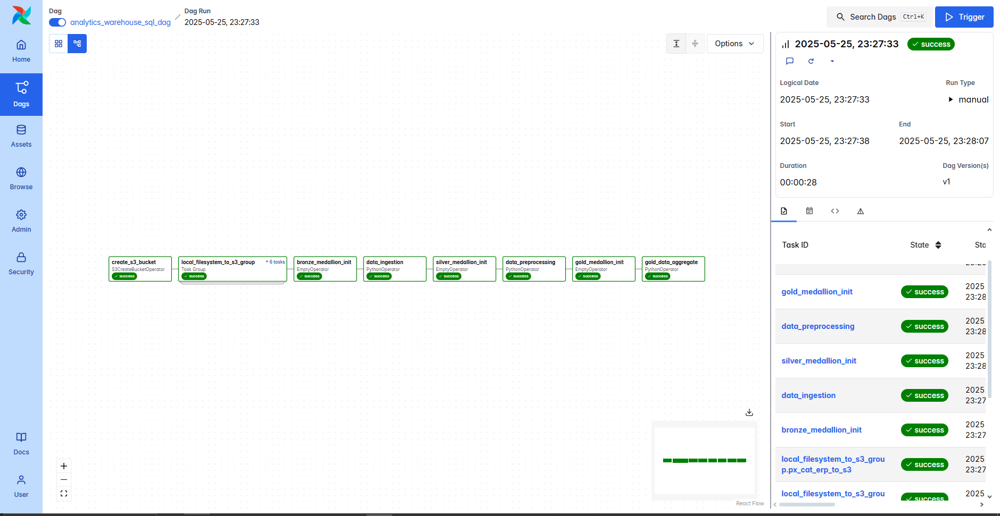
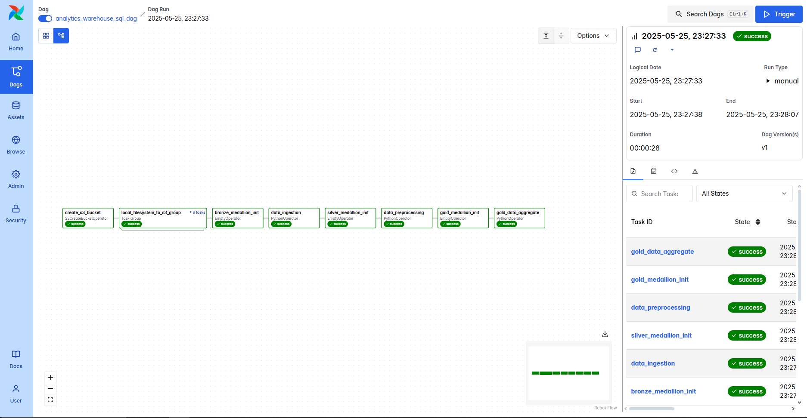

# 🏗️ Modern Data Pipeline with Airflow, PostgreSQL, MinIO, and Jupyter

This project sets up a full-fledged local **data pipeline environment** using Docker Compose, featuring:

- **Apache Airflow 3.0.1** (with CeleryExecutor)
- **PostgreSQL 16** as the metadata for Airflow
- **DuckDB** for Database Management
- **MinIO** as S3-compatible object storage
- **Jupyter Notebook** for exploratory data science
- **pgAdmin** for managing PostgreSQL
- **Redis** as the message broker for Celery
- **Flower** (optional) for Celery task monitoring





## 🚀 Getting Started

### Prerequisites

- Docker
- Docker Compose v2+

### 📦 Setup

1. Clone the repo:

   ```bash
   git clone https://github.com/ikigamisama/Data-Warehouse-Medallion.git
   cd your-repo
   ```

2. Create an `.env` file in the root directory:

   ```env
    AIRFLOW_UID=50000
    POSTGRES_HOST=postgres
    POSTGRES_USER=airflow
    POSTGRES_PASSWORD=airflow
    POSTGRES_DB=airflow
    POSTGRES_PORT=5432
    MINIO_ACCESS_KEY=minioLocalAccessKey
    MINIO_SECRET_KEY=minioLocalSecretKey123
   ```

3. Spin up the services:

   ```bash
   docker compose up --build
   ```

4. Access the services:

| Service    | URL                              | Credentials                      |
| ---------- | -------------------------------- | -------------------------------- |
| Airflow UI | http://localhost:8080            | airflow / airflow                |
| Flower UI  | http://localhost:5555 (optional) | (no auth by default)             |
| MinIO      | http://localhost:9001            | minio / minio123                 |
| pgAdmin    | http://localhost:5050            | admin@admin.com / admin123       |
| JupyterLab | http://localhost:8888            | Token: `DataWarehouseJupyterRun` |

---

## 🧱 Folder Structure

```
.
├── dags/                      # Airflow DAGs
├── config/                    # Custom Airflow configs (e.g., airflow.cfg)
├── plugins/                   # Custom Airflow plugins
├── logs/                      # Airflow logs
├── data/                      # Input/output data files
├── upstream/                  # DB init scripts for PostgreSQL
├── scripts/                   # Setup scripts (e.g., MinIO connection setup)
├── notebooks/                 # Jupyter notebooks
├── Dockerfile.airflow         # Custom Airflow Dockerfile
├── docker-compose.yml         # All service definitions
└── .env                       # Environment variables
```

---

## 🛠️ Customization

- **To install additional Python dependencies in Airflow**:
  Add them to `_PIP_ADDITIONAL_REQUIREMENTS` in your `.env`, or build a custom image using `Dockerfile.airflow`.

- **To add new S3 buckets or MinIO users**:
  Modify `scripts/setup_conn.py` and `minio_mc_setup` service in `docker-compose.yml`.

---

## 🧪 Useful Commands

- Initialize database & metadata:

  ```bash
  docker compose run airflow-init
  ```

- Open Airflow CLI:

  ```bash
  docker compose run airflow-cli
  ```

- Run Jupyter in browser:
  ```bash
  http://localhost:8888
  ```

---

## 📦 Built With

- [Apache Airflow](https://airflow.apache.org/)
- [PostgreSQL](https://www.postgresql.org/)
- [MinIO](https://min.io/)
- [Jupyter](https://jupyter.org/)
- [pgAdmin](https://www.pgadmin.org/)
- [Docker Compose](https://docs.docker.com/compose/)

---

## 🧹 Clean Up

To remove all containers, volumes, and networks:

```bash
docker compose down -v --remove-orphans
```

---

## 🔐 Security Warning

This stack is **not intended for production**. Passwords, tokens, and secrets are exposed and should be rotated in production-ready environments.

---

## 📬 Contact

For issues or contributions, please open an issue or PR in this repository.
